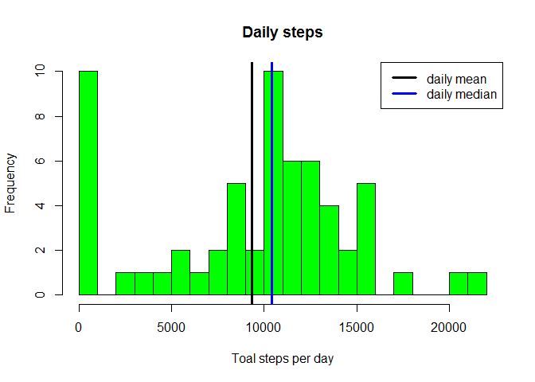
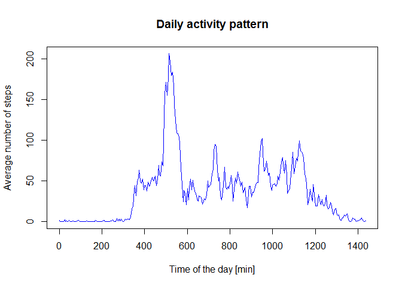
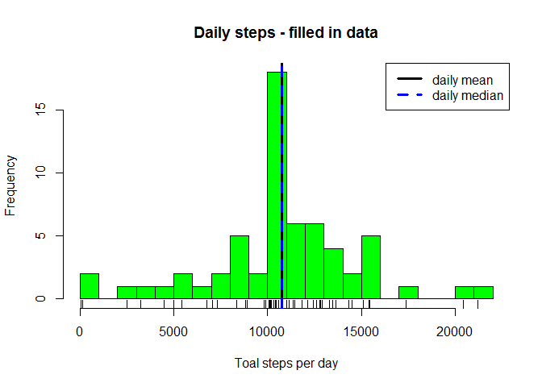
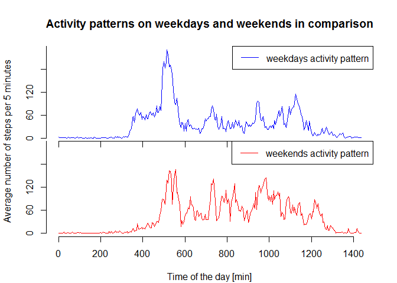

# Reproducible Research: Peer Assessment 1


## Loading and preprocessing the data
The compressed zip archive from the cloned repository (also available from 
<https://d396qusza40orc.cloudfront.net/repdata%2Fdata%2Factivity.zip>) was
unzipped then read into R using the read.csv() command. The date column was
reformated to be a Date object.


```r
## check if file exists, if not either unzip the archive or download and unzip
## if the zip archive is missing
if (!file.exists("activity.csv")){
    if (!file.exists("activity.csv")){
            download.file("https://d396qusza40orc.cloudfront.net/repdata%2Fdata%2Factivity.zip",
                          "activity.zip")
    }
    unzip("activity.zip")
}
## Read the file to the variable "activity""
activity <- read.csv("activity.csv",stringsAsFactors = FALSE)
## the dplyr package is required for the code
require(dplyr)
```

```
## Loading required package: dplyr
```

```
## Warning: package 'dplyr' was built under R version 3.2.3
```

```
## 
## Attaching package: 'dplyr'
```

```
## Die folgenden Objekte sind maskiert von 'package:stats':
## 
##     filter, lag
```

```
## Die folgenden Objekte sind maskiert von 'package:base':
## 
##     intersect, setdiff, setequal, union
```

```r
activity <- tbl_df(activity)
## reformat the date column as a Date variable
activity <- mutate(activity,date=as.Date(date))
head(activity)
```

```
## Source: local data frame [6 x 3]
## 
##   steps       date interval
##   (int)     (date)    (int)
## 1    NA 2012-10-01        0
## 2    NA 2012-10-01        5
## 3    NA 2012-10-01       10
## 4    NA 2012-10-01       15
## 5    NA 2012-10-01       20
## 6    NA 2012-10-01       25
```

## What is mean total number of steps taken per day?
The activity data was grouped by day, summarized, and the steps plotted as a
histogram.

```r
## group by days
activity.byday <- group_by(activity,date)
## get the total number of steps per day
summary.byday <- summarize(activity.byday,steps.total=sum(steps,na.rm=TRUE))
## calculate the daily mean and median
daily.mean <- mean(summary.byday$steps.total)
daily.median <- median(summary.byday$steps.total)

## plot the histogram of steps per day
with(summary.byday,hist(steps.total,
                        breaks=25,
                        col="green",
                        xlab="Toal steps per day",
                        main="Daily steps"))
abline(v=daily.mean,lwd=3,col="black")
abline(v=daily.median,lwd=3,col="blue")
legend("topright",lwd = c(3,3),col = c("black","blue"),legend = c("daily mean","daily median"))
```



Many days have no data available and are responsible for the high frequency of
days with almost no steps taken. The mean number of steps taken per day is 9354.2295082
(black line), and the median number of steps taken per day is 10395
(blue line).


## What is the average daily activity pattern?
The activity data was grouped by interval, summarized, and the mean number of
steps plotted as a time series plot. A time variable was added to show the
minute of the day for better readability.

```r
## grouping the activity data by the 5 minute intervals and summarizing the
## mean number of steps for them
activity.byinterval <- group_by(activity,interval)
summary.byinterval <- summarize(activity.byinterval,
                                average.steps=mean(steps,na.rm=TRUE))
## adding a time variable with unit minutes
summary.byinterval <- mutate(summary.byinterval,time=(0:287)*5)

## plot the daily activity pattern
with(summary.byinterval,plot(time,
                             average.steps,
                             xlab = "Time of the day [min]",
                             ylab = "Average number of steps",
                             type = "l",
                             col = "blue",
                             main = "Daily activity pattern"))
```



```r
## find the interval with the highest average steps
max.interval <- summary.byinterval[which.max(summary.byinterval$average.steps),]
```
The interval 835 contains the maximum number of steps on
average (206.1698113), which corresponds to the interval
between minute 515 and minute 520 of the
day (08:35 am to 08:40 am).


## Imputing missing values

```r
## Compute the missing values
missing.values <- is.na(activity$steps)
missing.values.count <- sum(missing.values)
```
The data set contains 2304 missing values for the steps
variable, and none for the date and interval variables. Therefore,
2304 rows are missing values. The missing values are not
isolated, but tend to stretch over longer,continuous periods of time when they
occur. This makes common methods to impute these values (like using the
surrounding interval) difficult to apply. Therefore, the missing values are
simply imputed with the rounded average number of steps for that interval over
all days, as computed for the daily activity pattern.


```r
## get an index for which missing values need to be imputed
index <- which(missing.values)
## initiate the new data frame for the imputed data set
activity.imputed <- activity
## impute NA values in the new data frame with the rounded average steps in an
## interval, as computed above
for (i in index){
    impute.index <- match(activity$interval[i],summary.byinterval$interval)
    activity.imputed$steps[i] <- round(summary.byinterval$average.steps[impute.index])
}
## the new data frame is complete
head(activity.imputed)
```

```
## Source: local data frame [6 x 3]
## 
##   steps       date interval
##   (dbl)     (date)    (int)
## 1     2 2012-10-01        0
## 2     0 2012-10-01        5
## 3     0 2012-10-01       10
## 4     0 2012-10-01       15
## 5     0 2012-10-01       20
## 6     2 2012-10-01       25
```

```r
## group imputed data frame by days
activity.imputed.byday <- group_by(activity.imputed,date)
## get the total number of steps per day for the imputed data
summary.imputed.byday <- summarize(activity.imputed.byday,steps.total=sum(steps,na.rm=TRUE))
## calculate the daily mean and median for the imputed data
daily.mean.imputed <- mean(summary.imputed.byday$steps.total)
daily.median.imputed <- median(summary.imputed.byday$steps.total)

## plot the histogram of steps per day for the imputed data
with(summary.imputed.byday,hist(steps.total,
                        breaks=25,
                        col="green",
                        xlab="Toal steps per day",
                        main="Daily steps - filled in data"))
abline(v=daily.mean.imputed,lwd=3,col="black")
abline(v=daily.median.imputed,lty=2,lwd=3,col="blue")
legend("topright",lwd = c(3,3),lty=c(1,2),col = c("black","blue"),legend = c("daily mean","daily median"))
rug(summary.imputed.byday$steps.total)
```



The mean number of steps taken per day is now 1.0765639\times 10^{4} (black line),
previously 9354.2295082 in the not imputed data set. The median number of
steps taken per day is 1.0762\times 10^{4} (blue striped line), previously 
10395 in the not imputed data set. The overall shape of the histogram is
very similar to the not imputed data set, but the peak at 0 to 1000 steps taken is
now gone, and the peak at 10000 to 11000 steps taken is much more pronounced. Mean
and median in the imputed data set are much closer together, and both have higher
values than in the not imputed data set. The seemingly higher steps per day in the
imputed data set probably are caused by the fact that days with all NA values were
interpreted as zero by the sum() function with the paramter na.rm set to TRUE,
while these days now have a close to average number of steps takes due to the
imputing strategy.

## Are there differences in activity patterns between weekdays and weekends?
A new variable to differentiate between weekends and weekdays was added to the
filled in data set. Then the data set was split in regards to this new variable,
separating the data from weekdays and weekends. both parts were grouped by
interval, summarized in regards to the mean steps in an interval,and the mean
number of steps plotted as a time series panel plot. A time variable was added
to show the minute of the day for better readability.

```r
## create a weekday.weekend factor variable to differentiate between weekdays and
## weekend
require(lubridate)
```

```
## Loading required package: lubridate
```

```
## Warning: package 'lubridate' was built under R version 3.2.3
```

```r
activity.imputed <- mutate(activity.imputed,weekday.weekend = (ifelse(wday(activity.imputed$date)==1,7,wday(activity.imputed$date)-1)>5)+1)
activity.imputed <- mutate(activity.imputed,weekday.weekend=as.factor(weekday.weekend))
levels(activity.imputed$weekday.weekend) <- c("weekday","weekend")

## split the data into weekdays and weekend data frames
activity.weekdays <- filter(activity.imputed,weekday.weekend=="weekday")
activity.weekend <- filter(activity.imputed,weekday.weekend=="weekend")

## grouping the imputed and split activity data by the 5 minute intervals and
## summarizing the mean number of steps for them
weekend.byinterval <- group_by(activity.weekend,interval)
weekdays.byinterval <- group_by(activity.weekdays,interval)
summary.weekend <- summarize(weekend.byinterval,
                                average.steps=mean(steps))
summary.weekdays <- summarize(weekdays.byinterval,
                                average.steps=mean(steps))

## adding a time variable with unit minutes
summary.weekend <- mutate(summary.weekend,time=(0:287)*5)
summary.weekdays <- mutate(summary.weekdays,time=(0:287)*5)

# set graphics variables for the panel plot
par(mfcol=c(2,1))
par(oma=c(4.1,4.1,4.1,2.1))
par(mar=c(0,0,0,0))

## plot the daily activity pattern for weekdays
with(summary.weekdays,plot(time,
                             average.steps,
                             type = "l",
                             axes=FALSE,
                             col = "blue"))
axis(1,labels=FALSE)
axis(2,seq(0,240,60))
legend("topright",col="blue",lwd=1,legend="weekdays activity pattern")
## plot the daily activity pattern for weekends
## plotting weekday data first to force identical scaling for comparison
with(summary.weekdays,plot(time,
                             average.steps,
                             type = "n",
                             axes=FALSE))
## adding the weekend data
lines(summary.weekend$time,summary.weekend$average.steps,col="red")
axis(1)
axis(2,seq(0,240,60))
legend("topright",col="red",lwd=1,legend="weekends activity pattern")
title(ylab="Average number of steps per 5 minutes",outer=TRUE)
title(xlab="Time of the day [min]",outer=TRUE)
title(main="Activity patterns on weekdays and weekends in comparison", outer=TRUE)
```



There are distinct differences between the activity patterns on weekdays and
weekends. The activity in on weekdays starts earlier and has a higher peak in
the first 12 hours of he days, while the weekend activity is higher in the
second half of the day.


